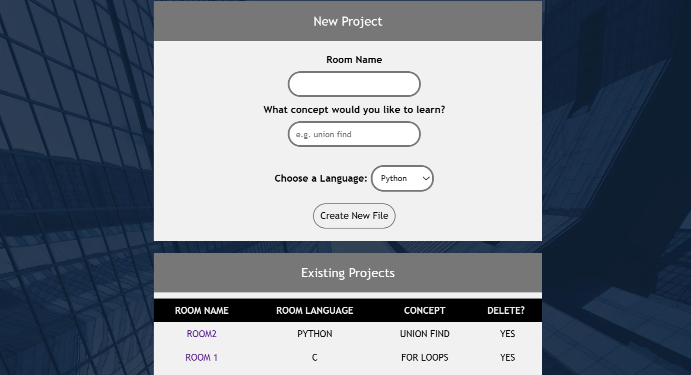
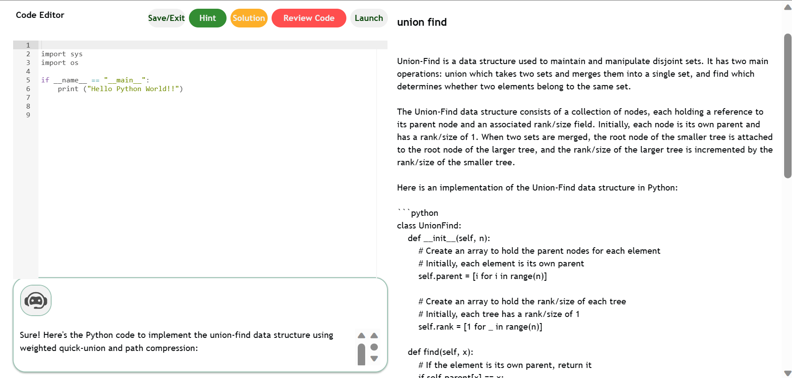

# SEEK 

## Introduction


Hi, we are SEEK, currently second-year students from Nanyang Technological University with the background of Mathematical Sciences and Computer Sciences. In this era of continuous digital pursuit, it is no wonder of the demand for knowledge of computing languages and the beauty of works computing can bring to us. In line with the chosen theme, our venture, **CODE LAB** is an educational AI tool designed by students for students, seeking to provide personalized education for whatever students wish to learn. 

<br>

## Our Team 
1. Goh Chun Ren 
<br> Github Handle: [Strirex](https://github.com/Strirex)
<br> Email: gbdfaqw@gmail.com

2. Goh Yan Yi, Chermaine
<br> Github Handle: [chermainegoh](https://github.com/chermainegoh)
<br> Email: chearmine02@gmail.com

3. Gordon Tian Xiao Chen
<br> Github Handle: [GordenChen19](https://github.com/GordonChen19) 
<br> Email: chengordon8@gmail.com

4. Ng Shi Ying
<br> Github Handle: [shiying09](https://github.com/shiying09)
<br> Email: ngshiying09@gmail.com

5. Yuen Jia Qing, Ivan
<br> Github Handle: [ivanyjq](https://github.com/ivanyjq)
<br> Email: ivanyuenjiaqing@hotmail.com 

<br>

## Theme of Submission 🗊 
SEEK is inspired by the theme of **Digital Empowerment**, in which the project statement chosen is by **IMDA --- Creating Opportunities with Emerging Technologies**: 
<br>
<em>"Develop innovative and creative solutions that leverages on emerging technologies such as GenAI to increase access to information and opportunities and empower individuals and communities to thrive in this digital world. The solution could create opportunities and address challenges from digital divide, reduce bias, and promote equity using digital solutions.” </em>

<br>

## Overview
In our first two years of University, computing is a new venture for most of us. The idea of <em>Personalised Learning</em> resonates with us as we recognised how many individuals have different learning aptitudes, abilities and prior knowledge. The current climate also presents an issue where some communities do not have access to high quality education, due to social or economic reasons. Leveraging on AI-powered online education allows the possibility for all people regardless of their social or economic background to receive high quality education. This hopes to reduce bias and promote equity in allowing everyone to learn and grow their skillsets together.
<br>
|Pain Points   			        | Our Ideals	                        | 
|:----------------:	            |:--------:	 	                                |
|Lack of real-time help and sharing of codes often leads to the problem of bugs and having to incorporate the time lag to debug   | Real-time collaborative workspace where students can type in their codes and GenAI to provide comments and suggestions immediately  | 
|Time lag to search the required files and opening it on coding software | All in one platform to write and run codes, with clear organisation of project folders and coding files | 	

<br>

## Get Started
**Prerequisites**
<br>
Before you begin, make sure you have the following installed:
- Python (version 3.6 or higher)
- pip (package installer for Python)
<br>

**Installation**
1. Clone this repository  
```
git clone https://github.com/GordonChen19/CodeLab-Source-Code.git
```

2. Navigate to the project directionary: 
```
cd CodeLab-Source-Code
```

3. Create a virtual environment: 
```
python -m venv myenv
```

4. Activate the virtual environment: 
    - On macOS and Linux:
    ```
    source myenv/bin/activate
    ```

    - On Windows (Command Prompt):
    ```
    myenv\Scripts\activate.bat
    ```

5. Install the dependencies: 
```
pip install -r requirements.txt
```
<br>

**Usage**
<br>
To run CODELAB, execute the following command: 
```
python main.py
```
The application will start running on "http://localhost:5000".

<br>

## Features 
**Projects Directory** <br>
First, create a 'Room Name' and type in 'What concept you would like to learn'. You may select the following computing languages to learn: Python, C, C++. 



<br>

**Code Editor** <br>
After creation of the room, you will be redirected to this page below. For instance, you are interested to learn the concept of <em>Union Find</em>. On the right, a description of <em>Union Find</em> will be given and a random question will be generated for students to answer on the IDE on the top left of the screen. 
<br>

At the bottom left, our friendly Robo will help you out!
- Click on 'hints' to get help on the question you are working on
- Click on 'solution' to check your answer
- Click on 'code review' to determine how to improve your answer



<br>

## Future Prospects 
Moving forward, we hope to expand **CODE LAB** further to incorporate new and improved features: 
- Incorporating more computing languages for learning
- Creating a collaborative space where students can learn together and share their knowledge with one another. This can also be a collaborative platform whereby educators may utilise as a flipped classroom to teach students. 
- Visualisation tools whereby users can create flowcharts to form codes and vice versa 
- Not only for computing, we hope to venture further into other subjects like English and Mathematics, together with the help of Generative AI to create a personalised learning environment to guide students with diverse needs. 

<br>

## Tech Stack
- Languages: HTML, CSS, Python, JavaScript